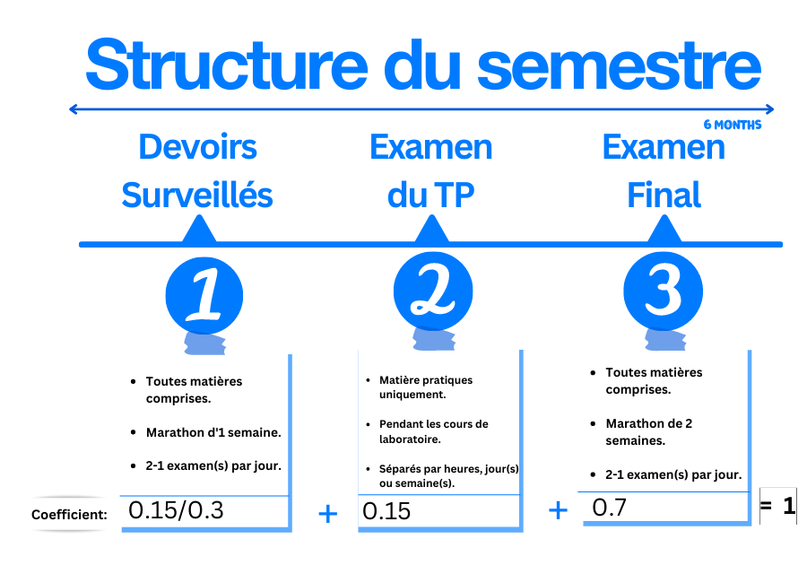

---

# Motivation
Une carrière dans les technologies de l'information peut être extrêmement enrichissante, tant sur le plan financier que professionnel. Ce licence fournira une base solide en informatique, du matériel de bas niveau (assemblage) aux langages largement utilisés comme C, C++ et Python. En plus d'aider à la mise en réseau, aux scripts avec Bash et à la sécurité. Cela peut également mener à des postes d'execution et de direction au sein de l'industrie plus tard.

Vous découvrirez certaines des choses incroyables que les gens font avec la technologie et comment vous pouvez vous impliquer!

 

  

# Chemin vers 2 options
Après deux semestres de réussite dans le domaine d'études choisi, l'étudiant devrait pouvoir choisir l'une des deux spécialités pour les trois semestres restants. Cela permettra au candidat de concentrer ses études sur un domaine spécifique et d'acquérir plus de connaissances dans ce domaine. En choisissant une spécialité, les étudiants seront également mieux préparés pour leur future carrière.

- IOT & systèmes embarqués
- Ingénierie des réseaux et des systèmes

> L'ISTIC avait l'habitude d'affecter les étudiants avec des notes plus élevées à l'IOT ; Cela pourrait impliquer que l'IOT est la meilleure option. Ce n'est pas. Les deux voies sont excellentes.

# Méthodologie d'Examen
L'actif ci-dessous décrit la méthodologie de surveillance utilisée pour chaque semestre.
- **1:** Un examen écrit sur toutes les matières abordées.
- **2:** Examens pratiques pour des sujets spécifiques nécessitant l'utilisation de logiciels.
- **3:** Les examens finaux, qui jouent le rôle le plus important dans la réussite du semestre.

# Expérience professionnelle
Les étudiants doivent effectuer au moins deux stages. Les stages offrent aux étudiants la possibilité d'acquérir de l'expérience dans leur domaine d'intérêt et de développer des compétences professionnelles. 

Pour plus d'informations sur les stages, veuillez consulter [cette page](fr/intern.md).

# Démarrer
Ce site servira d'introduction à certaines des incroyables innovations que le monde exploite constamment pour apporter de la valeur, telles que le Web, le développement mobile, l'architecture informatique, la programmation de microcontrôleurs, le cloud computing et les tests de logiciels. Bien que l'informatique semble avoir reçu le plus d'attention ces dernières années, cela est équivalent en termes de connaissances fournies.

Chaque section comprendra des ressources et du contenu utiles pour vous aider à exceller dans votre préparation et à tirer le meilleur parti de votre formation.

##### La documentation est structurée comme suit.
- **Mutuel**
  - [Semester Ⅰ](Semester1/1.md )
  - [Semester Ⅱ](Semester2/2.md)
 
- **Spécialité IOT & systèmes embarqués**
  - [Semester Ⅲ - IOT](Semester3-IOT/3.md)
  - [Semester Ⅳ - IOT](Semester4-IOT/4.md)
  - [Semester Ⅴ - IOT](Semester5-IOT/5.md)
- **Spécialité Ingénierie des Réseaux et Systèmes** 
  - [Semester Ⅲ - IRS](Semester3-IRS/3.md)
  - [Semester Ⅳ - IRS](Semester4-IRS/4.md)
  - [Semester Ⅴ - IRS](Semester5-IRS/5.md)

## QR-Code pour les mobiles

Emportez vos études avec vous partout où vous allez. **Scannez** le code ci-dessous et essayez sur les mobiles.

