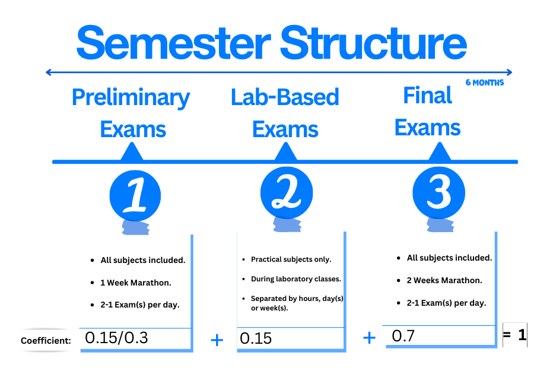

 

# Motivation

*Welcome* to the guide for computer engineering bachelor's students aspiring to build a successful career in the field of Information Technology.

**Is it right for you?**
- **Future-proof career:** The demand for IT professionals like you is expected to continue growing.
- **Versatile skills:** Comprehensive skill set that allows you to adapt to changing tech.
- **Lucrative earning potential:** Companies are willing to invest more and more in top talent.

The power is now in your hands. 

🎯 Let's jump on this exciting journey together and discover the fascinating world of IT and tomorrows!

# Empowering Students
This guide aims to complement your degree by introducing you to a range of remarkable innovations that the world is constantly leveraging to provide value incl.  web, mobile development, computer architecture, security, and cloud computing.

**TL;DR** The content presented does not carry any official affiliation or rights from the designated institution. 
Instead, it represents a collaborative endeavor by 2 individuals committed to delivering information, resources and help you level up — Why? Because why not!

# Path to options
In terms of your degree, you have 5 semesters total. After 2 semesters, the student should be able to select one of two specialties for the remaining three semesters. 

This will enable the pursuer to concentrate their studies on a specific area and gain more knowledge in that domain.
- IOT & Embedded systems (IOT)
- Network and Systems Engineering (IRS)

> ISTIC used to assign students with higher grades to IOT; This could imply that IOT is the best option. It is not. Both paths are excellent.

# Examining methodology
The asset below depicts the proctoring methodology used for each semester.
- **1:** A written exam on all of the subjects covered.
- **2:** Hands-on exams for specific subjects that necessitate the use of software.
- **3:** Final exams, which play the most important role in the semester's success.

# Professional Experience: Internship
Students are required to have at least **two** **internships**. 

| 𝑛 | Mandatory Internship           |Term   |
|-- |----------------------          |:-----: |
| ❶ | Project End of the Year        | PFA    |
| ❷ | Project End of Study           | PFE    | 

Internships provide students with the opportunity to gain experience in their field of interest and to develop professional skills. 

- ⚠️ *Quickstart* your⚡Summer Internship⚡️from [here.](https://istic.computer-engineering.tech/#/intern)

# Get Started

Each section will include usefull resources and content to assist you in excelling in your preparation and making the most of your education.
##### The guide is structured as follows.

| Mutual      | IOT & Embedded systems Speciality |Network and Systems Engineering Speciality |Compressed Materials|   
| ----------- | ----------- |----------- |----------- |
| [Semester Ⅰ](Semester1/1.md )|[Semester Ⅲ - IOT](Semester3-IOT/3.md)| [Semester Ⅲ - IRS](Semester3-IRS/3.md)|[Renewal Process](renewal/README.md)|
| [Semester Ⅱ](Semester2/2.md)        |[Semester Ⅳ - IOT](Semester4-IOT/4.md)| [Semester Ⅳ - IRS](Semester4-IRS/4.md) | [Open Labs](https://labs.computer-engineering.tech/)|
| [Internships](intern.md)       |[Semester Ⅴ - IOT](Semester5-IOT/5.md)| [Semester Ⅴ - IRS](Semester5-IRS/5.md) | [Old Version](https://stale.computer-engineering.tech/#/)|

